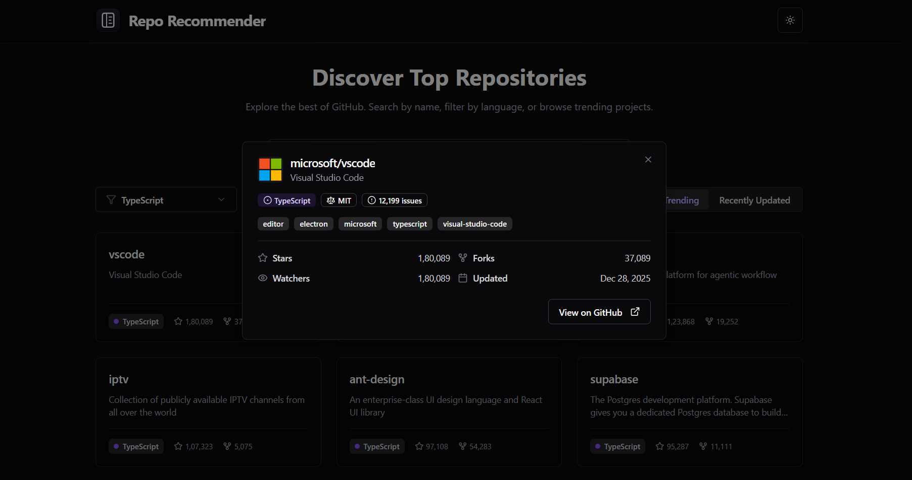

# GitHub Repository Recommender

[](https://github.com/)
[](https://vitejs.dev/)
[](https://reactjs.org/)
[](https://tailwindcss.com/)
[](LICENSE)

A sleek, responsive React application that lets you discover, search, and filter GitHub repositories using the GitHub REST API. Built with Vite + React and TailwindCSS, with a small, focused codebase and accessible components.

---

## Screenshots

<p align="center">
  
  <br />
  <em>Home — search, filters, and repo list</em>
</p>

<p align="center">
  
  <br />
  <em>Repo modal — details, stats and links</em>
</p>

---

## Features

- **Search Repositories** — Real-time search with a debounce hook (`useDebounce`) for better UX.
- **Filters** — Language and sorting selectors to narrow results (Stars, Forks, Updated).
- **Repo Details Modal** — Rich details view with topics, license, issues, and quick link to GitHub.
- **Responsive Design** — Layouts and modal scale up for larger screens (desktop & large monitors).
- **Accessible UI** — Built using Radix primitives and simple semantics.
- **Infinite Loading / Pagination** — "Load More" style loading for additional results.
- **Error Handling** — Graceful handling of API errors and rate limit feedback.

## Tech Stack

- **Frontend**: React, Vite
- **Styling**: TailwindCSS
- **Icons**: Lucide React
- **Components**: Radix UI primitives
- **Hooks**: Custom `useDebounce` for search

---

## Setup Instructions

1. Clone the repository
   ```bash
   git clone https://github.com/JeetMajumdar2003/repo-recommender.git
   cd repo-recommender
   ```

2. Install dependencies
   ```bash
   npm install
   ```

3. Start the development server
   ```bash
   npm run dev
   ```

4. Build for production
   ```bash
   npm run build
   ```

---

## API Rate Limiting

This app uses the public GitHub API. Unauthenticated requests are subject to GitHub's rate limits. If you hit the limit, the UI will show an error message with guidance to try again later or use an authenticated token.

---

## Contributing

Contributions are welcome — feel free to open issues or PRs for bug fixes, enhancements, or accessibility improvements.

## License

MIT License. See the [LICENSE](LICENSE) file for details.